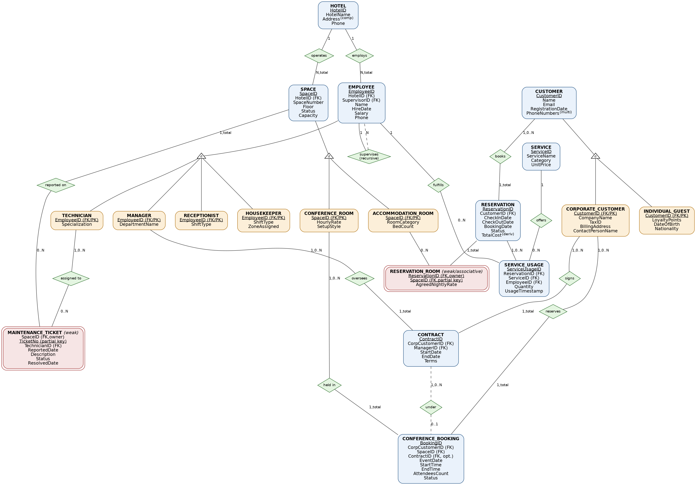

# Hotel Chain, Conference & Service Management System — Database

A relational database design and implementation for a multi-property hotel chain, covering accommodation, corporate conference bookings, guest services, and staff management. Built with a full conceptual-to-physical workflow: EER modeling, relational mapping, normalization, and a production-style PostgreSQL implementation with triggers, views, and constraint-driven business rules.

## Overview

Modern hotel chains run four interconnected operations at once: room inventory across properties, a mixed clientele of individual guests and corporate accounts, a multi-role workforce, and on-demand guest services layered on top of reservations. This project models that domain end-to-end as a relational database — not just a set of tables, but a schema that actively enforces the business rules of the domain through constraints and triggers rather than relying on application code.

The project was built as a full database-design exercise: starting from a conceptual EER model, mapping it to a normalized relational schema, and implementing it as executable, tested PostgreSQL DDL.

## Key Features

- **Multi-hotel, multi-space inventory** — accommodation rooms and conference spaces modeled as a disjoint, total specialization of a shared `SPACE` entity, each with its own pricing and capacity rules.
- **Mixed clientele model** — individual guests and corporate accounts share a `CUSTOMER` supertype but diverge in loyalty tracking, billing, and booking permissions (only corporate accounts can reserve conference spaces — enforced structurally, not just by convention).
- **Recursive staff hierarchy** — a self-referencing `SUPERVISES` relationship models managers overseeing teams of other employees.
- **Weak & associative entities** — multi-room reservations and per-space maintenance tickets are modeled with proper weak-entity semantics rather than flattened into parent tables.
- **Trigger-enforced double-booking prevention** — a `BEFORE INSERT/UPDATE` trigger rejects any room reservation that temporally overlaps an existing one, with a second trigger closing the edge case where a reservation's dates are edited directly rather than through the room-linkage table.
- **Derived-attribute maintenance** — a reservation's total cost is automatically recalculated via triggers whenever its room lines or service charges change, rather than being computed ad hoc by every reader.
- **Analytical & protective views** — role-appropriate views expose aggregated revenue data and hide sensitive HR fields (e.g., salary) from general queries.
- **Curated query set** — eight SQL queries spanning the full range of relational operations (multi-table joins, outer joins, correlated subqueries, grouping, and a relational-division query), each targeting a distinct, non-trivial business question rather than a generic textbook example.

## Entity-Relationship Design

The conceptual model features three specialization hierarchies (`SPACE`, `CUSTOMER`, `EMPLOYEE`), a recursive relationship, composite/multivalued/derived attributes, and both a weak entity and an associative many-to-many entity — see [`docs/eer-diagram.png`](EER/eer-diagram.png) for the full diagram.

<p align="center">
  
</p>

## Schema Highlights

| Entity | Notes |
|---|---|
| `HOTEL` | Chain properties; each owns its own spaces and staff. |
| `SPACE` → `ACCOMMODATION_ROOM` / `CONFERENCE_ROOM` | Disjoint, total specialization; each subtype carries its own pricing model. |
| `CUSTOMER` → `INDIVIDUAL_GUEST` / `CORPORATE_CUSTOMER` | Only corporate customers can hold `CONTRACT`s or make `CONFERENCE_BOOKING`s. |
| `EMPLOYEE` → `RECEPTIONIST` / `HOUSEKEEPER` / `MANAGER` / `TECHNICIAN` | Self-referencing `SupervisorID` models the reporting hierarchy. |
| `RESERVATION` / `RESERVATION_ROOM` | A reservation may span multiple rooms; each room line locks in its own agreed nightly rate. |
| `SERVICE` / `SERVICE_USAGE` | On-demand guest services (dining, spa, transit, laundry) charged to a stay and fulfilled by a specific employee. |
| `CONTRACT` / `CONFERENCE_BOOKING` | Corporate account agreements and the events booked under them. |
| `MAINTENANCE_TICKET` | Weak entity tracking infrastructure issues per space, assigned to a technician. |

## Tech Stack

- **Database:** PostgreSQL 16
- **Procedural logic:** PL/pgSQL (trigger functions)
- **Design artifacts:** EER diagram, relational mapping, normalization proof (3NF/BCNF), relational algebra

## Getting Started

```bash
createdb hoteldb
psql -d hoteldb -f  hotel_management_system_database_project.sql
```

The script is fully self-contained: it (re)creates the schema from scratch, applies all constraints, seeds a realistic test dataset (3 hotels, 13 spaces, 10 staff, 13 customers, 15 reservations, conference bookings, service logs, and maintenance tickets), installs the views and triggers, and finishes by running the sample query set.

## Project Structure

```
.
├──  hotel_management_system_database_project.sql    # Full DDL, constraints, triggers, views, seed data, and sample queries
├── docs/
│   └── eer-diagram.png   # Conceptual EER diagram
└── README.md
```

## Design Highlights

### Business rules enforced at the schema level
Rather than trusting application code, key rules are pushed down into the database itself:
- A room cannot be double-booked for overlapping dates — enforced by a trigger on the reservation-room linkage table, *and* re-checked if a reservation's dates are edited directly rather than through that table.
- Only corporate accounts can book conference spaces — enforced structurally via foreign-key targeting of the corporate-customer subtype table, not by an application-side check.
- Check-out must follow check-in, event end times must follow start times, and a manager cannot supervise themselves — all enforced with `CHECK` constraints.

### Sample queries
The query set intentionally exercises distinct parts of the schema rather than repeating the same pattern:

1. Selection + projection — VIP guest tiering via a computed column
2. Multi-table join — reservation ↔ guest ↔ hotel ↔ room
3. Self-join — manager team sizes via the recursive supervision relationship
4. Aggregation + grouping — conference revenue by room setup style
5. `HAVING` — repeat guests above a spending threshold
6. Correlated subquery — corporate events above average attendance
7. `NOT EXISTS` — contracts with zero bookings against them
8. **Relational division** — guests who have used *every* service category offered

## Normalization

A separate normalization exercise (included in the accompanying project report) takes a deliberately denormalized invoice log and walks it through 1NF → 2NF → 3NF → BCNF, identifying every functional dependency and the violation it resolves at each step.

## Possible Extensions

- REST API layer for reservation and booking workflows
- Payment gateway integration
- A lightweight admin dashboard for occupancy and revenue reporting
- Row-level security for multi-tenant hotel-staff access

## License

This project is available for educational and portfolio use.
